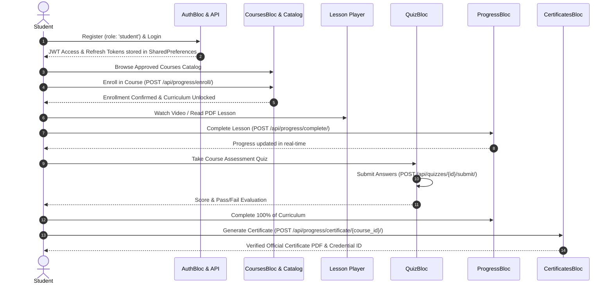
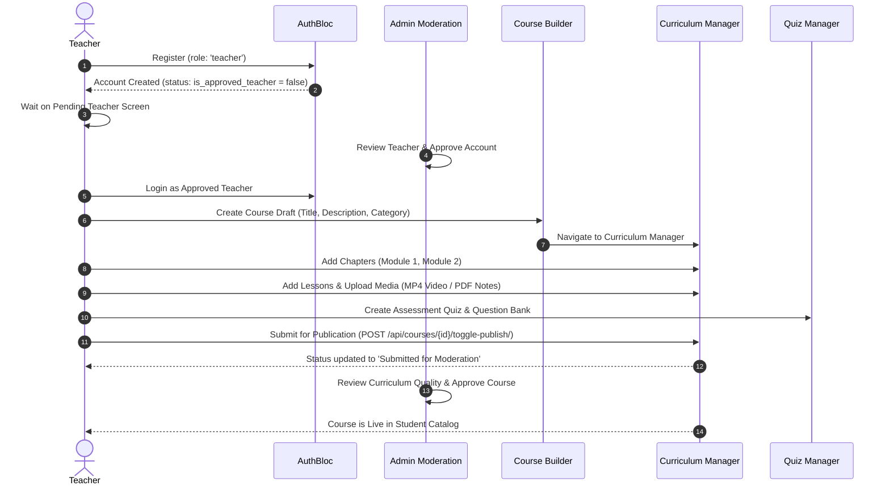
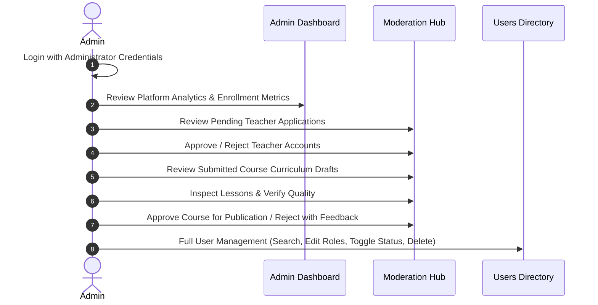

# EduFlow — End-to-End User Workflows & Journey Guides

This document outlines the complete user journeys, business flows, and interaction sequences for all three roles in EduFlow: **Student**, **Teacher**, and **Admin**.

---

## 1. Student Journey

### Key Student Milestones:
1. **Authentication:** Registration and Login with automatic token refresh.
2. **Discovery & Enrollment:** Browse approved catalog, view course syllabus, and confirm enrollment.
3. **Interactive Learning:** Watch video lectures, download lesson PDFs, and read textual guides.
4. **Lesson Progression:** Automatically track completed lessons and progress percentages.
5. **Quiz Assessments:** Take timed modular quizzes and review detailed performance breakdowns.
6. **Credentialing:** Claim and download official certificates of completion upon reaching 100% course progress.

---

## 2. Teacher Journey

### Key Teacher Milestones:
1. **Registration & Approval:** Register as instructor and await administrator account approval.
2. **Course Creation:** Define course title, description, category, and pricing.
3. **Curriculum Design:** Organize course into structured chapters and modules.
4. **Content Uploads:** Upload high-definition video lectures (MP4) and downloadable reading guides (PDF).
5. **Assessment Authoring:** Create quizzes with customizable question choices and pass criteria.
6. **Publication Submission:** Submit finalized curriculum for administrative quality moderation.
7. **Student Analytics:** Review enrolled students' completion rates and quiz results.

---

## 3. Administrator Journey

### Key Admin Milestones:
1. **Platform Analytics:** Monitor total registered learners, published courses, quiz completion stats, and top course leaderboards.
2. **Teacher Account Moderation:** Review instructor credentials and grant platform publishing rights.
3. **Curriculum Moderation:** Inspect course syllabus, verify lesson videos and PDFs, and approve or reject submissions.
4. **User Directory Governance:** Search, filter, inspect profiles, update user roles, and deactivate or delete accounts.
